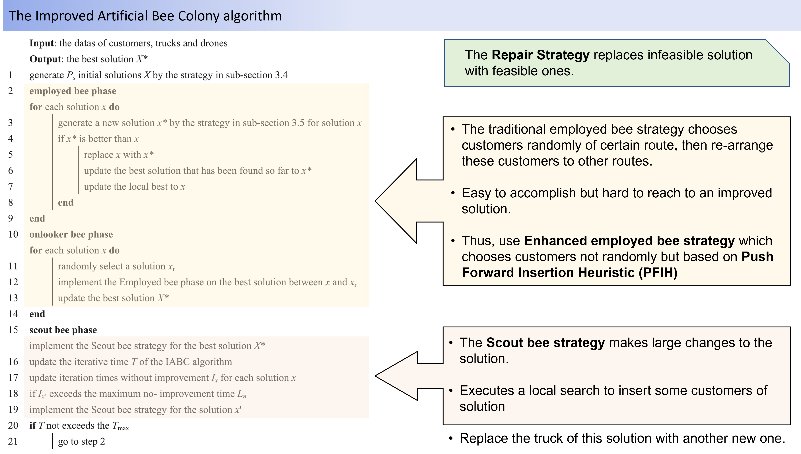
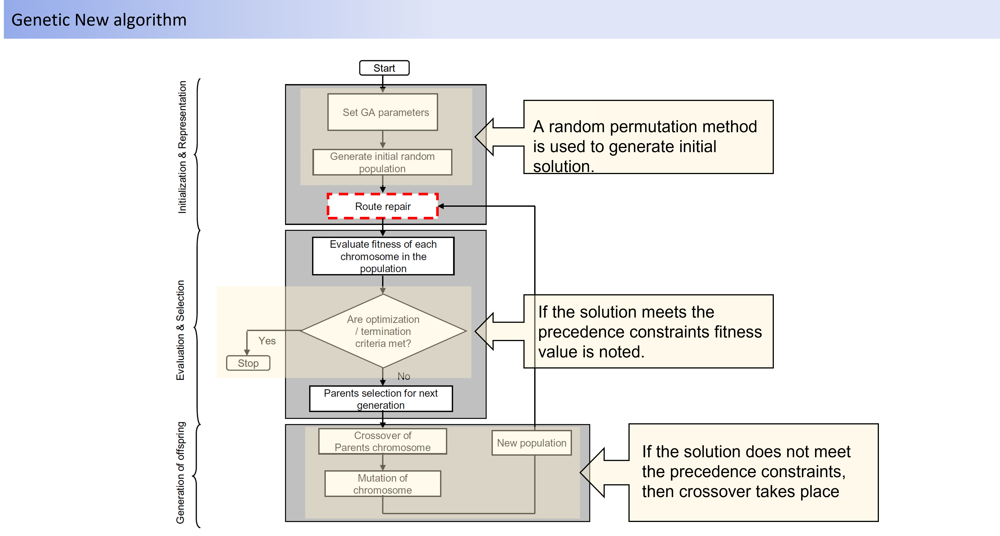

# Transportation_Planning
Identified and explained in detail the gaps and possible future works for improvement for two popular research papers that used heuristic and meta-heuristic algorithms to solve multi-objective vehicle routing problem with time window.

